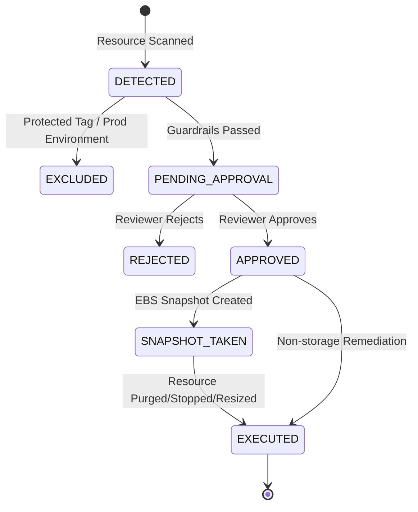

# 💡 Event-Driven FinOps & Cloud Waste Eliminator

[](LICENSE)
[](https://www.python.org/downloads/)
[](https://www.terraform.io/)
[](https://aws.amazon.com/)
[](https://aws.amazon.com/bedrock/)
[](https://flake8.pycqa.org/)

An automated, serverless FinOps & Cloud Governance platform that continuously audits AWS infrastructure for unoptimized and idle resources (unattached EBS volumes, disassociated Elastic IPs, idle RDS instances, and over-provisioned Lambda memory). It calculates monthly recoverable spend, leverages AI reasoning (Amazon Bedrock) for context-aware rightsizing recommendations, and executes safe remediation workflows with human-in-the-loop approval.

---

## 🎯 Key Metrics & Business Value

```
┌─────────────────────────────────┬─────────────────────────────────┬─────────────────────────────────┐
│     📉 25-35% Waste Reduction   │    🛡️ 100% Zero Data Loss       │     ⚡ $0.00 Idle Cost          │
│   Identifies & eliminates       │   Mandatory pre-deletion EBS    │   100% Serverless architecture  │
│   silent infrastructure waste   │   snapshots & tag-based guard   │   (Lambda + DynamoDB Pay-per-req│
└─────────────────────────────────┴─────────────────────────────────┴─────────────────────────────────┘
```

- **Problem:** In enterprise AWS environments, 25% to 35% of cloud expenditure stems from abandoned or unoptimized resources left behind after migrations, deployments, and testing.
- **Solution:** A scheduled, event-driven engine that scans resources, computes financial waste using exact AWS pricing models, generates AI-assisted rightsizing rationale, and remediates with strict safety guardrails.

---

## 🏛️ End-to-End Architecture

```mermaid
flowchart TD
    subgraph Trigger & Scheduling
        EB[EventBridge Cron\nNightly at 03:00 UTC]
        CLI[Cloud Engineer / FinOps CLI]
    end

    subgraph Serverless Detection Engine
        Scanner[Scanner Lambda\nPython 3.12]
        Guardrails[Safety Guardrails & Tag Filters\nDoNotDelete / Prod Shield]
        Pricing[FinOps Pricing Engine\nExact AWS us-east-1 Rates]
        AI[FinOps AI Advisor\nAmazon Bedrock / Fallback Heuristic]
    end

    subgraph Target AWS Infrastructure
        EBS[(Unattached EBS Volumes\nStatus: Available)]
        EIP[Unallocated Elastic IPs\nHourly Reservation Penalty]
        RDS[(Idle RDS Databases\n< 2% CPU, 0 Connections)]
        Lambda[Over-provisioned Lambdas\nMemory Slack > 60%]
    end

    subgraph Persistence & Approval Lifecycle
        DDB[(DynamoDB Findings Table\nPENDING_APPROVAL)]
        Approver[Admin Reviewer\nWebhook / Terminal Approval]
        Remediator[Remediation Lambda\nSnapshot-First Safety]
    end

    EB --> Scanner
    Scanner --> EBS & EIP & RDS & Lambda
    Scanner --> Pricing
    Pricing --> Guardrails
    Guardrails --> AI
    AI --> DDB
    DDB --> Approver
    Approver -->|APPROVE| Remediator
    Remediator -->|Snapshot -> Delete / Stop / Rightsize| Target AWS Infrastructure
```

---

## 🔍 Waste Detection & Optimization Breakdown

| Resource | Waste Detection Logic | AWS Pricing Model Applied | Recommended Action | Safety & Data Preservation |
| :--- | :--- | :--- | :--- | :--- |
| **EBS Volumes** | Volume in `available` state (detached from EC2 for >1 day) | `$0.08 - $0.125 / GB-month` based on volume type (`gp3`, `gp2`, `io1`) | `delete_ebs_with_snapshot` | **Mandatory Snapshot:** Automatically creates a backup snapshot tagged `CreatedBy=CloudWasteEliminator` before deletion. |
| **Elastic IPs** | Public IP with neither `InstanceId` nor `NetworkInterfaceId` | `$3.65 / month` ($0.005/hr idle reservation fee) | `release_eip` | Releases IP back to AWS pool, halting continuous hourly penalties. |
| **RDS Instances** | Average CPU ≤ 2.0% over 7 days in `available` status with zero connections | Full compute hourly charge (`db.t3.medium` = ~$49.64/mo) | `stop_rds_instance` | **Non-destructive:** Stops compute billing while preserving underlying storage and automated backups. |
| **Lambda Memory** | Memory allocated > 128 MB with observed peak utilization < 40% | GB-second execution rate differential (`$0.0000166667 / GB-s`) | `rightsize_lambda_memory` | Downsizes memory to optimal bracket with an added **30% execution buffer headroom**. |

---

## 🛡️ Safety Guardrails & Human-in-the-Loop Policy

Automated cloud remediation requires strict guardrails to prevent accidental service disruption:

1. **Tag-Based Exclusion:** Any resource carrying `DoNotDelete=true`, `KeepAlive=true`, `Protection=true`, or `FinOpsExclude=true` is automatically marked as `EXCLUDED` and cannot be remediated.
2. **Production Safeguard:** Resources tagged with `Environment=production` or `Stage=prod` are flagged as `HIGH` risk and strictly blocked from automated remediation.
3. **Snapshot-First EBS Purge:** No storage volume is deleted without first creating an idempotent, tagged snapshot.
4. **Dry-Run by Default:** All CLI and webhook executions default to `dry_run=true` unless explicitly overridden.



---

## 🖥️ Live Terminal & Showcase Preview

The project includes an interactive terminal simulator that validates scanning, Bedrock reasoning, and remediation without incurring AWS charges:

```text
$ python demo.py

╭────────────────────────────────────────────────────────────────────╮
│ 💡 Event-Driven FinOps & Cloud Waste Eliminator                    │
│ Serverless Cloud Cost Optimization & Autonomous Rightsizing Engine │
╰────────────────────────────────────────────────────────────────────╯

Step 1: Simulating EventBridge Scheduled Scan across AWS Account...
                      AWS Waste Audit Findings (us-east-1)                      
┏━━━━━━━━━━━━┳━━━━━━━━━━━━┳━━━━━━━━━━━━┳━━━━━━━━━━━━━┳━━━━━━━━━━━━┳━━━━━━━━━━━━┓
┃ Finding ID ┃ Resource   ┃ Type       ┃ Monthly     ┃ Risk Level ┃ Status     ┃
┡━━━━━━━━━━━━╇━━━━━━━━━━━━╇━━━━━━━━━━━━╇━━━━━━━━━━━━━╇━━━━━━━━━━━━╇━━━━━━━━━━━━┩
│ ebs-vol-0… │ vol-0e319… │ ebs_volume │ $80.00/mo   │ MEDIUM     │ PENDING_A… │
├────────────┼────────────┼────────────┼─────────────┼────────────┼────────────┤
│ eip-eipal… │ eipalloc-… │ elastic_ip │ $7.30/mo    │ LOW        │ PENDING_A… │
├────────────┼────────────┼────────────┼─────────────┼────────────┼────────────┤
│ rds-test-… │ test-anal… │ rds_insta… │ $49.64/mo   │ LOW        │ PENDING_A… │
├────────────┼────────────┼────────────┼─────────────┼────────────┼────────────┤
│ lambda-re… │ report-ge… │ lambda_fu… │ $16.80/mo   │ LOW        │ PENDING_A… │
└────────────┴────────────┴────────────┴─────────────┴────────────┴────────────┘
╭──────────────────────── 📊 FinOps Executive Summary ─────────────────────────╮
│ Detected Waste Items: 4                                                      │
│ Total Monthly Waste: $153.74 / month                                         │
│ Recoverable Annual Savings: $1844.88 / year                                  │
│                                                                              │
│ FinOps AI Summary: Identified 4 unoptimized resources yielding $153.74/mo in │
│ recoverable spend. Primary waste driver is unattached storage and idle       │
│ database capacity.                                                           │
╰──────────────────────────────────────────────────────────────────────────────╯

Step 2: Inspecting AI Recommendation for Top Waste Driver...
╭───────────────────── 🤖 AI Rightsizing & Safety Review ──────────────────────╮
│ Target: vol-0e3199b50fa (ebs_volume)                                         │
│ Recommended Action: delete_ebs_with_snapshot                                 │
│ Reason: Unattached 800GB gp2 volume detached since 45 days ago.              │
│                                                                              │
│ AI Rationale: Action recommended due to ongoing monthly storage charges of   │
│ $80.00 without active I/O. Snapshot creation prior to deletion ensures zero │
│ data loss risk. Verified savings: $80.00/mo.                                 │
╰──────────────────────────────────────────────────────────────────────────────╯

Step 3: Human-in-the-Loop Safe Remediation
Triggering approved remediation for ebs-vol-0e3199b50fa (Dry-Run Safety Mode)...
╭──────────────────────────────────────────────────────────────────────────────╮
│ ✓ Execution Completed Successfully                                           │
│ Status: EXECUTED                                                             │
│ Finding: ebs-vol-0e3199b50fa                                                 │
│ Details: {'success': True, 'dry_run': True, 'action':                        │
│ 'delete_ebs_with_snapshot', 'resource_id': 'vol-0e3199b50fa'}               │
╰──────────────────────────────────────────────────────────────────────────────╯
```

---

## ⚡ Quickstart & Local Setup

### 1. Clone & Set Up Environment

```bash
git clone https://github.com/ekrmcakir/cloud-waste-eliminator.git
cd cloud-waste-eliminator

# Create Python 3.12 virtual environment
python3 -m venv .venv
source .venv/bin/activate

# Install dependencies
pip install -r requirements-dev.txt
```

### 2. Run Interactive Showcase

```bash
python demo.py
```

### 3. Command Line Interface (CLI)

```bash
# Run simulation across synthetic infrastructure
python -m src.cli simulate

# Query all pending findings in the state store
python -m src.cli list-findings --status PENDING_APPROVAL

# Inspect detailed telemetry, tags, and AI reasoning for a finding
python -m src.cli inspect ebs-vol-08fa112a9b

# Approve remediation in dry-run mode (simulated)
python -m src.cli approve ebs-vol-08fa112a9b --dry-run

# Approve remediation for live execution (live cloud mutation)
python -m src.cli approve ebs-vol-08fa112a9b --no-dry-run

# Reject remediation
python -m src.cli reject ebs-vol-08fa112a9b
```

---

## 🧪 Testing & Code Quality

The project includes 19 comprehensive unit tests covering all pricing calculations, safety guardrails, scanner mocks, and remediation executors:

```bash
pytest -v
```

```text
============================= test session starts ==============================
platform darwin -- Python 3.12.3, pytest-9.1.1, pluggy-1.6.0
collected 19 items                                                             

tests/test_advisor.py::test_heuristic_advisor_analyzes_ebs PASSED        [  5%]
tests/test_advisor.py::test_heuristic_advisor_generates_summary PASSED   [ 10%]
tests/test_advisor.py::test_summary_empty_findings PASSED                [ 15%]
tests/test_guardrails.py::test_guardrail_blocks_exclusion_tags PASSED    [ 21%]
tests/test_guardrails.py::test_guardrail_blocks_production_environments PASSED [ 26%]
tests/test_guardrails.py::test_guardrail_passes_clean_dev_resource PASSED [ 31%]
tests/test_pricing.py::test_ebs_pricing_calculation PASSED               [ 36%]
tests/test_pricing.py::test_eip_pricing_calculation PASSED               [ 42%]
tests/test_pricing.py::test_rds_pricing_calculation PASSED               [ 47%]
tests/test_pricing.py::test_lambda_rightsizing_calculation PASSED        [ 52%]
tests/test_remediation.py::test_dry_run_does_not_mutate PASSED           [ 57%]
tests/test_remediation.py::test_ebs_remediation_snapshots_then_deletes PASSED [ 63%]
tests/test_remediation.py::test_eip_remediation_releases_address PASSED  [ 68%]
tests/test_remediation.py::test_rds_remediation_stops_instance PASSED    [ 73%]
tests/test_remediation.py::test_lambda_remediation_updates_memory PASSED [ 78%]
tests/test_scanners.py::test_ebs_scanner_detects_unattached_volume PASSED [ 84%]
tests/test_scanners.py::test_eip_scanner_detects_unattached_address PASSED [ 89%]
tests/test_scanners.py::test_rds_scanner_detects_idle_database PASSED    [ 94%]
tests/test_scanners.py::test_lambda_scanner_detects_overprovisioned_memory PASSED [100%]

============================== 19 passed in 0.27s ==============================
```

```bash
# Verify PEP8 and lint compliance
flake8 src tests demo.py --max-line-length=120
```

---

## 🏗️ Terraform Infrastructure as Code

The entire serverless infrastructure is defined using modular, least-privilege Terraform:

```bash
cd terraform

# Initialize Terraform providers
terraform init

# Validate configuration syntax
terraform validate

# Plan and apply
terraform plan
terraform apply
```

### Provisioned Resources:
- **`aws_dynamodb_table.waste_findings`**: On-demand (PAY_PER_REQUEST) table tracking finding state and audit trail.
- **`aws_cloudwatch_event_rule.nightly_waste_scan`**: Nightly cron trigger (`cron(0 3 * * ? *)`).
- **`aws_lambda_function.scanner`**: Python 3.12 scanner with read-only least-privilege IAM policies.
- **`aws_lambda_function.remediation`**: Remediation handler with snapshot/deletion permissions.
- **`aws_iam_role` & `aws_iam_policy`**: Strict separation between scanner and mutator roles.

---

## ⚙️ Configuration Reference

| Environment Variable | Default Value | Description |
| :--- | :--- | :--- |
| `AWS_REGION` | `us-east-1` | Target AWS region for scanning and remediation |
| `FINOPS_TABLE_NAME` | `finops-cloud-waste-findings` | DynamoDB table name for findings persistence |
| `FINOPS_DRY_RUN` | `true` | If true, logs actions without mutating AWS infrastructure |
| `RDS_IDLE_CPU_THRESHOLD`| `2.0` | CPU utilization percentage threshold for idle RDS detection |
| `RDS_IDLE_DAYS` | `7` | Evaluation window (in days) for CloudWatch RDS metrics |
| `LAMBDA_MEMORY_SLACK_RATIO` | `0.40` | Memory utilization ratio below which Lambda is flagged |
| `BEDROCK_MODEL_ID` | `amazon.nova-lite-v1:0` | Amazon Bedrock model ID for rightsizing reasoning |
| `ENABLE_AI_ADVISOR` | `true` | Enables AI advisor (falls back to heuristic if offline) |

---

## 📁 Repository Structure

```text
cloud-waste-eliminator/
├── src/
│   ├── models.py             # Strongly-typed domain models (Pydantic v2)
│   ├── config.py             # Thresholds, pricing constants & exclusion rules
│   ├── pricing.py            # AWS pricing calculation formulas
│   ├── scanners/             # Modular resource scanners
│   │   ├── base.py           # Abstract BaseScanner interface
│   │   ├── ebs.py            # Unattached EBS volume scanner
│   │   ├── eip.py            # Disassociated Elastic IP scanner
│   │   ├── rds.py            # Idle RDS database scanner (CloudWatch CPU)
│   │   └── lambda_fn.py      # Over-provisioned Lambda memory scanner
│   ├── advisor/
│   │   └── bedrock_advisor.py# Amazon Bedrock LLM rightsizing analyst
│   ├── safety/
│   │   ├── guardrails.py     # Tag exclusion & production protection engine
│   │   └── state_store.py    # DynamoDB finding persistence & audit log
│   ├── remediation/
│   │   └── executor.py       # Snapshot-first AWS remediation executor
│   ├── handlers/
│   │   ├── scan_handler.py   # EventBridge -> Scanner Lambda entrypoint
│   │   └── remediation_handler.py # Webhook/API -> Remediation Lambda entrypoint
│   └── cli.py                # Rich terminal CLI
├── terraform/                # Complete Infrastructure as Code
│   ├── main.tf
│   ├── variables.tf
│   ├── dynamodb.tf
│   ├── iam.tf
│   ├── lambda.tf
│   ├── eventbridge.tf
│   └── outputs.tf
├── tests/                    # 19 comprehensive unit tests
├── demo.py                   # Single-command demonstration runner
├── pyproject.toml            # Package configuration
├── pytest.ini                # Pytest configuration
├── requirements.txt          # Production dependencies
└── requirements-dev.txt      # Development & testing dependencies
```

---

## ❓ Frequently Asked Questions (FAQ)

<details>
<summary><strong>1. Can this tool accidentally delete critical production data?</strong></summary>
<p>
No. The platform enforces three independent safety layers:
1. <strong>Tag-based shield:</strong> Any resource tagged with <code>Environment=prod</code> or <code>Environment=production</code> is automatically blocked from remediation.
2. <strong>Mandatory Snapshots:</strong> EBS volumes cannot be deleted without an automated, tagged backup snapshot.
3. <strong>Human-in-the-Loop:</strong> The system defaults to <code>PENDING_APPROVAL</code>; no deletion occurs without explicit engineer sign-off.
</p>
</details>

<details>
<summary><strong>2. What happens if Amazon Bedrock is not available in my AWS region?</strong></summary>
<p>
The <code>FinOpsAIAdvisor</code> automatically detects missing credentials or API timeouts and seamlessly switches to an internal, deterministic heuristic reasoning engine. No scans or workflows will fail.
</p>
</details>

<details>
<summary><strong>3. Can I test this without connecting to an AWS account?</strong></summary>
<p>
Yes! Running <code>python demo.py</code> or <code>python -m src.cli simulate</code> executes a full end-to-end simulation using synthetic cloud resources and local JSON state persistence.
</p>
</details>

---

## 📄 License

This project is licensed under the [MIT License](LICENSE).
